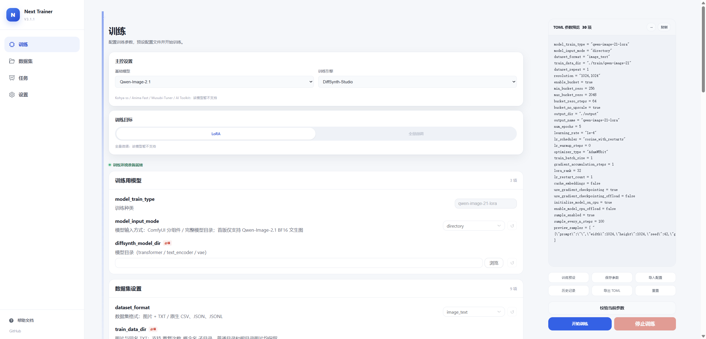

  

  <strong>A local training workbench for multiple models and engines</strong> 
  Prepare datasets, train models, and follow your runs in one place.

  <a href="https://github.com/wochenlong/lora-scripts-next/releases">Download</a> ·
  <a href="docs/getting-started.en.md">Quick start</a> ·
  <a href="docs/README.md">Documentation</a> ·
  <a href="README-zh.md">中文</a>

Train Qwen-Image-2.1 LoRA with the DiffSynth engine, with training configuration and TOML preview side by side. [Qwen-Image-2.1 beginner's guide (Chinese)](docs/diffsynth.md) · [Explore the workspace](docs/interface-tour.md).

## What's new in 3.1.1

- **DiffSynth / Qwen-Image-2.1:** BF16 text-to-image LoRA training with an isolated engine environment, image + TXT datasets, and previews during training. Image-edit training is not yet supported.
- **Anima Fast:** continue to train Anima 2.9B and T-LoRA with a dedicated runtime.
- **Multiple engines, one workspace:** manage Kohya, Anima Fast, Musubi, AI Toolkit, and DiffSynth from the same interface.
- **Smoother training workflows:** improved task management, configuration imports, and step/epoch handling.

[Full changelog](CHANGELOG.md) · [Qwen-Image-2.1 guide (Chinese)](docs/diffsynth.md) · [Anima Fast guide](docs/anima-fast.md)

## Supported training engines

**Kohya · Anima Fast · Musubi · AI Toolkit · DiffSynth-Studio**

Kohya is built in. Install the optional engines from **Settings → Training engines**, then select the appropriate engine on the training page. Available engines depend on your trainer version; not every model or feature supported upstream is integrated here.

For Qwen-Image-2.1, select **DiffSynth-Studio → LoRA**. Current support is **BF16 text-to-image training**, not image-edit training.

## Supported models

**Qwen-Image-2.1 · Anima · SD 1.5 · SDXL · Flux · FLUX.2 Klein · Krea 2**

Training targets, hardware requirements, and optional engine installation vary by model. See the [training guides](docs/README.md#training--训练).

## Get started

**Windows users:** [download a portable package](https://github.com/wochenlong/lora-scripts-next/releases), extract it, and use the included launcher. An NVIDIA GPU is required; see [setup and package selection](docs/getting-started.en.md).

**Release status:** 3.1.1 source is on `main`. Portable packages have their own release schedule; check the version and release notes on Releases. Older packages may not include DiffSynth or Qwen-Image-2.1 support.

For the 3.1.1 source version or Linux setup, follow [run from source](docs/getting-started.en.md#from-source).

---

[Documentation](docs/README.md) · [Report an issue](https://github.com/wochenlong/lora-scripts-next/issues) · [Credits](docs/credits.md) · [Contributors](CONTRIBUTORS.md)
